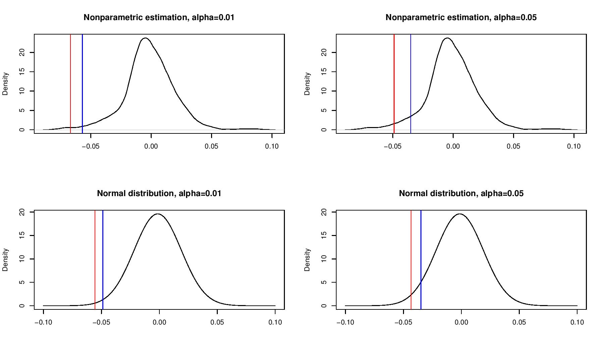

[](http://quantlet.de/)

## [](http://quantlet.de/) **XFG_VaR_ES** [](http://quantlet.de/)

```yaml

Name of QuantLet : XFG_VaR_ES

Published in : 

Description : 'Creates density plots with VaR and Expected Shortfall of Deutsche Bank daily stock returns in a time period from April 2017 - April 2019. Compares the nonparametric kernel density estimate with a parametric maximum likelihood estimate assuming normal distributed returns.'

Keywords : VaR, Expected Shortfall, ES, kernel density

See also : 'MSM_VaRandES, SFEVaRbank, SPMkdeconstruct'

Author : Georg Keilbar

Submitted : April 4 2019 by Georg Keilbar

```



### R Code
```r

#Set working directory
setwd("~/Desktop/IRTG/Teaching/R")

#Read in data
data = read.csv("DBK.DE.csv")

#Generate daily log returns
x = diff(log(as.numeric(data$Close)),lag=1)

#Calculate the sample VaR and Expected Shortfal, alpha={0.01, 0.05}
VaR_5 = quantile(x,0.05)
VaR_1 = quantile(x,0.01)
ES_5 = mean(x[x<quantile(x,0.05)])
ES_1 = mean(x[x<quantile(x,0.01)])

par(mfrow=c(2,2))

#Kernel density plot with VaR and ES (alpha=0.01)
plot(density(x,bw=0.005,kernel="epanechnikov"),main="Nonparametric estimation, alpha=0.01",xlab="")
abline(v=VaR_1,col="blue")
abline(v=ES_1,col="red")

#Kernel density plot with VaR and ES (alpha=0.05)
plot(density(x,bw=0.005,kernel="epanechnikov"),main="Nonparametric estimation, alpha=0.05",xlab="")
abline(v=VaR_5,col="blue")
abline(v=ES_5,col="red")

#Calculate the MLE under normal distributed errors
mu = mean(x)
sigma = sd(x)
VaR_1_N = qnorm(0.01, mu, sigma)
VaR_5_N = qnorm(0.05, mu, sigma)
ES_1_N = mu - sigma * dnorm(qnorm(1-0.01)) / (0.01)
ES_5_N = mu - sigma * dnorm(qnorm(1-0.05)) / (0.05)

#Normal density plot with VaR and ES (alpha=0.01)
plot(dnorm(seq(-0.1,0.1,0.0001),mu,sigma)~seq(-0.1,0.1,0.0001),type="l",main="Normal distribution, alpha=0.01",xlab="",ylab="Density")
abline(v=VaR_1_N,col="blue")
abline(v=ES_1_N,col="red")

#Normal density plot with VaR and ES (alpha=0.05)
plot(dnorm(seq(-0.1,0.1,0.0001),mu,sigma)~seq(-0.1,0.1,0.0001),type="l",main="Normal distribution, alpha=0.05",xlab="",ylab="Density")
abline(v=VaR_5_N,col="blue")
abline(v=ES_5_N,col="red")

dev.off()

#Calculate skewness and kurtosis
s = mean((x-mu)^3)/(sigma^3)
k = mean((x-mu)^4)/(sigma^4)

```

automatically created on 2019-04-29